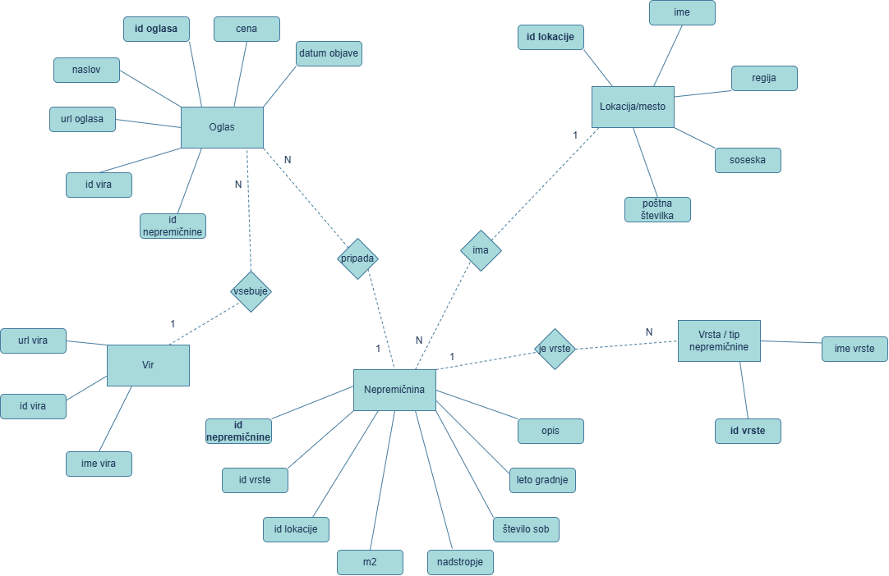

# OPB - Najem nepremičnin

**AVTORJA:** Jure Kraševec in Urh Videčnik

Projektna naloga pri predmetu Osnove podatkovnih baz.

## Opis projekta
Projekt obravnava podatkovno bazo in spletno aplikacijo za pregled ponudbe najema nepremičnin. Namen aplikacije je uporabnikom omogočiti iskanje in pregled oglasov za najem nepremičnin glede na različne kriterije, kot so lokacija, tip nepremičnine, velikost, cena in druge lastnosti.

V okviru projekta bova zasnovala relacijsko podatkovno bazo z ustreznim ER diagramom, pripravila podatke za bazo ter razvila preprosto aplikacijo za prikaz in analizo oglasov. Poseben poudarek bo na povezavah med oglasi, nepremičninami, lokacijami, tipi nepremičnin in viri podatkov.

Cilj projekta je prikazati smiselno uporabo relacijskih baz, SQL poizvedb in osnovne spletne aplikacije nad podatkovno bazo.

## ER-diagram

