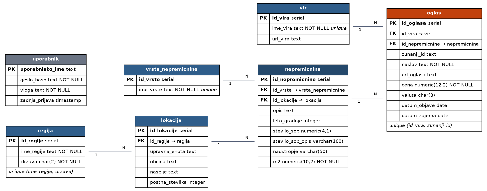

# Najem nepremičnin

Projektna naloga pri predmetu **Osnove podatkovnih baz** (FMF, 3. letnik).
Avtorja: Jure Kraševec in Urh Videčnik.

[](https://mybinder.org/v2/gh/UrhVidecnik/OPB-Najem-nepremicnin/main?urlpath=proxy/8080)

Spletna aplikacija za pregled ponudbe najema nepremičnin v Sloveniji in na
Hrvaškem. Podatke smo pobrali s portala
[nepremicnine.net](https://www.nepremicnine.net) (2690 oglasov) in jih shranili
v bazo PostgreSQL na strežniku FMF, aplikacija pa nad njimi omogoča iskanje,
filtriranje in statistično analizo.

## Kaj aplikacija omogoča

* Iskanje po ključni besedi (naslov, opis, kraj) in filtriranje po vrsti
  nepremičnine, državi, regiji, ceni, površini, številu sob in letu gradnje.
* Razvrščanje po ceni, površini, ceni na m², letu gradnje ali naslovu;
  rezultati so razdeljeni na strani.
* Podrobnosti oglasa z izračunano ceno na m², povezavo do izvirnega oglasa in
  seznamom podobnih oglasov v isti regiji.
* Statistiko: povprečje, mediana, minimum in maksimum najemnin, histogram
  porazdelitve cen ter primerjavo po regijah in vrstah nepremičnin. Vsi
  izračuni se izvedejo v bazi z agregatnimi funkcijami SQL.
* Registracijo in prijavo (gesla so shranjena kot bcrypt hash), dodajanje
  oglasov za prijavljene uporabnike ter urejanje in brisanje za skrbnike.

## Podatkovna baza



| Tabela | Pomen |
|---|---|
| `vir` | portal, s katerega je oglas pobran |
| `vrsta_nepremicnine` | šifrant vrst; zajeli smo samo `Stanovanje` |
| `regija` | regija in država (`SI` / `HR`) |
| `lokacija` | upravna enota, občina in naselje znotraj regije |
| `nepremicnina` | m², sobe, leto gradnje, nadstropje |
| `oglas` | objava za najem: naslov, cena, povezava, datum |
| `uporabnik` | uporabniki aplikacije in njihove vloge |
| `oglas_pregled` (pogled) | vsi podatki o oglasu na enem mestu in cena na m² |

Regijo smo ločili od lokacije, ker se v podatkih ponovi na stotine krat;
država je lastnost regije, saj vsaka regija pripada natanko eni državi.
Šifrant `vrsta_nepremicnine` je pripravljen za več vrst, v zajetih podatkih
pa nastopa samo `Stanovanje` – scraper smo usmerili na oglase za oddajo
stanovanj. Shema zato brez sprememb prenese tudi hiše ali poslovne
prostore, če bi zajem razširili.

Oglas hrani tudi `zunanji_id` (ID oglasa na portalu), omejitev
`UNIQUE (id_vira, zunanji_id)` pa poskrbi, da uvoz podatkov lahko poženemo
večkrat, ne da bi se oglasi podvojili.

Shema je v `Data/create_database.sql`, pravice v `Data/pravice.sql`.

## Struktura projekta

```
OPB-Najem-nepremicnin/
├── app.py                  spletna aplikacija (poti)
├── init_db.py              ustvari shemo baze in podeli pravice
├── nastavi_admina.py       dodeli ali odvzame vlogo admin
├── testi.py                testi vseh treh nivojev
├── er-nepremicnine.png     ER diagram (slika za README)
├── er-nepremicnine.svg     isti diagram v vektorski obliki
│
├── Data/                   podatkovni nivo
│   ├── create_database.sql   tabele, indeksi, pogled
│   ├── pravice.sql           GRANT ukazi
│   ├── prikaz_baze.sql       poizvedbe za predstavitev
│   ├── er_diagram.py         nariše ER diagram (er-nepremicnine.svg)
│   ├── models.py             podatkovni modeli
│   ├── repository.py         vse SQL poizvedbe
│   ├── nalozi_v_bazo.py      uvoz CSV v bazo
│   ├── auth_public.py        javni bralni dostop (je v gitu)
│   └── auth.py               osebni dostop s pisanjem (ni v gitu)
│
├── Services/               aplikacijski nivo
│   ├── service.py            poslovna logika in validacija
│   └── auth_service.py       prijava, registracija, vloge
│
├── Presentation/           predstavitveni nivo
│   ├── bottleext.py          dopolnitve ogrodja Bottle
│   ├── static/style.css
│   └── views/                predloge HTML
│
├── Scrape Data/            zajem podatkov
│   ├── scrape_all_data.py    scraper (Playwright + BeautifulSoup)
│   └── oglasi_*.csv          pobrani podatki
│
└── binder/                 zagon na mybinder.org
```

Aplikacija je razdeljena na tri nivoje in vsak govori samo s tistim pod sabo:

```
app.py  →  Services/  →  Data/repository.py  →  PostgreSQL
```

`app.py` ne piše SQL, `Services` se z bazo ne pogovarja neposredno. Če se
shema spremeni, popravimo samo `repository.py`.

## Namestitev in zagon

```bash
git clone https://github.com/UrhVidecnik/OPB-Najem-nepremicnin.git
cd OPB-Najem-nepremicnin

python3 -m venv env
source env/bin/activate      # na Windows: env\Scripts\activate

pip install -r requirements.txt
python app.py
```

Aplikacija se odpre na <http://localhost:8080>, ustaviš jo s `Ctrl+C`.
Vse ukaze poganjaj iz korenske mape projekta.

Privzeto se aplikacija poveže z bazo kot uporabnik `javnost` (geslo je v
`Data/auth_public.py`, ker ni tajno). Ta uporabnik sme podatke brati in
dodajati, ne sme pa jih spreminjati ali brisati – za brskanje in registracijo
torej ni treba nastaviti ničesar.

Za urejanje in brisanje oglasov ter za pripravo baze potrebuješ osebni dostop.
Skopiraj `Data/auth_public.py` v `Data/auth.py` in vpiši svoje podatke:

```python
db = "sem2026_urhvid"
host = "baza.fmf.uni-lj.si"
user = "tvoje_uporabnisko_ime"
password = "tvoje_geslo"
port = 5432
```

`Data/auth.py` je v `.gitignore`, zato ne bo romala na GitHub.

## Uporabniki in vloge

* neprijavljen: brskanje, iskanje, filtri in statistika
* `uporabnik`: poleg tega še dodajanje oglasov
* `admin`: poleg tega še urejanje in brisanje oglasov

Vsak, ki se registrira, dobi vlogo `uporabnik`. Vloge namenoma ni mogoče
spremeniti prek spletnega vmesnika – če bi obstajala stran "postani admin", bi
jo lahko odprl vsakdo. Skrbnika zato določi lastnik baze iz ukazne vrstice:

```bash
python nastavi_admina.py --seznam            # uporabniki in njihove vloge
python nastavi_admina.py urh                 # obstoječega naredi za admina
python nastavi_admina.py jure --geslo GESLO  # ustvari uporabnika in ga naredi za admina
python nastavi_admina.py jure --odvzemi      # odvzame skrbniške pravice
```

Dostop je zavarovan na treh mestih. Predloge HTML skrijejo gumbe, ki jih
uporabnik ne sme uporabiti, kar pa je samo udobje – naslov `/uredi/123` lahko
kdorkoli vtipka v brskalnik. Zato dekoratorja `zahtevaj_prijavo` in
`zahtevaj_admina` v `app.py` dostop tudi zares preprečita in vrneta 403, vlogo
pa pri tem preberemo iz baze in ne iz piškotka. Piškotki so poleg tega
podpisani (`Presentation/bottleext.py`), zato si uporabnik ne more sam
nastaviti `vloga=admin`. Zadnja obramba so pravice v PostgreSQL: uporabnik
`javnost` nima pravic `UPDATE` in `DELETE` nad oglasi, zato jih ne more
spremeniti niti, če bi se na bazo povezal mimo aplikacije. Nad tabelo
`uporabnik` sme spreminjati samo stolpec `zadnja_prijava` (`GRANT UPDATE
(zadnja_prijava)`) – vloge tudi po tej poti ni mogoče povišati.

## Priprava baze od začetka

Ta korak je potreben samo ob prvi postavitvi ali ob spremembi sheme in zahteva
`Data/auth.py` s pravico pisanja.

```bash
python init_db.py               # ustvari tabele, indekse in pogled; pobriše obstoječe
python -m Data.nalozi_v_bazo    # uvozi oglase iz CSV
```

Uvoz sprejme še `--suho` (samo preveri, nič ne zapiše), `--omejitev N` in
`--datoteka pot.csv`. Na koncu izpiše, koliko oglasov je bilo vstavljenih,
koliko preskočenih (ker so že v bazi) in koliko zavrnjenih zaradi neveljavnih
podatkov.

## Testi

```bash
python testi.py
```

35 testov pokriva modele, validacijo, poizvedbe, filtriranje, ostranjevanje,
statistiko, prijavo in idempotentnost uvoza. Testi, ki pišejo v bazo, se
preskočijo, če si povezan kot `javnost`; testni podatki se na koncu pobrišejo.

## Zajem podatkov

Scraper je ločen od aplikacije in ga ni treba poganjati – pobrani podatki so v
`Scrape Data/oglasi_full.csv`.

```bash
pip install -r "Scrape Data/requirements.txt"
playwright install firefox

cd "Scrape Data"
cp .env.example .env
python scrape_all_data.py
```

Dela v dveh korakih: najprej prebere strani s seznami oglasov
(`oglasi_osnovno.csv`), nato še detajlne strani posameznih oglasov
(`oglasi_lokacije.csv`, od koder dobimo hierarhijo regija → upravna enota →
občina → naselje), na koncu pa oboje združi v `oglasi_full.csv`. Uporablja
Playwright s Firefoxom brez okna, ker portal blokira zahtevke navadnih
knjižnic in brskalnikov na osnovi Chromiuma.

## Poizvedbe za predstavitev

V `Data/prikaz_baze.sql` je 14 poizvedb, razvrščenih od preprostega štetja
vrstic do okenskih funkcij in CTE. Poganjaj jih po eno naenkrat (pgAdmin,
DBeaver ali `psql`).

## Vir podatkov

Podatki so pobrani s portala [nepremicnine.net](https://www.nepremicnine.net)
in služijo izključno študijskim namenom.
